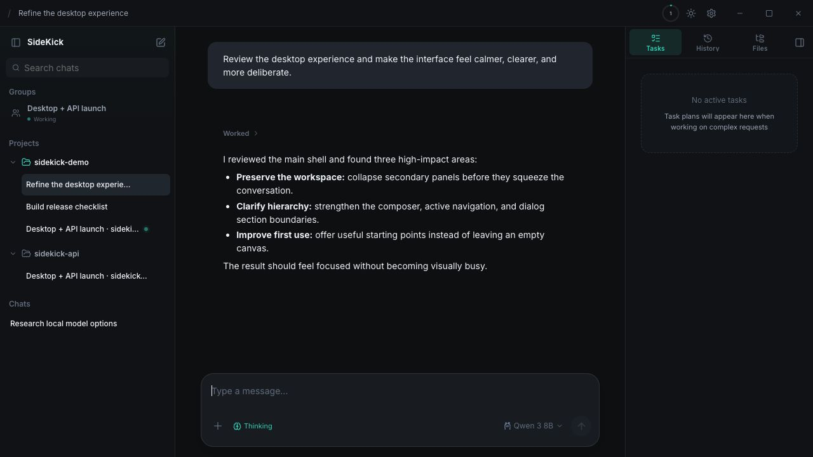
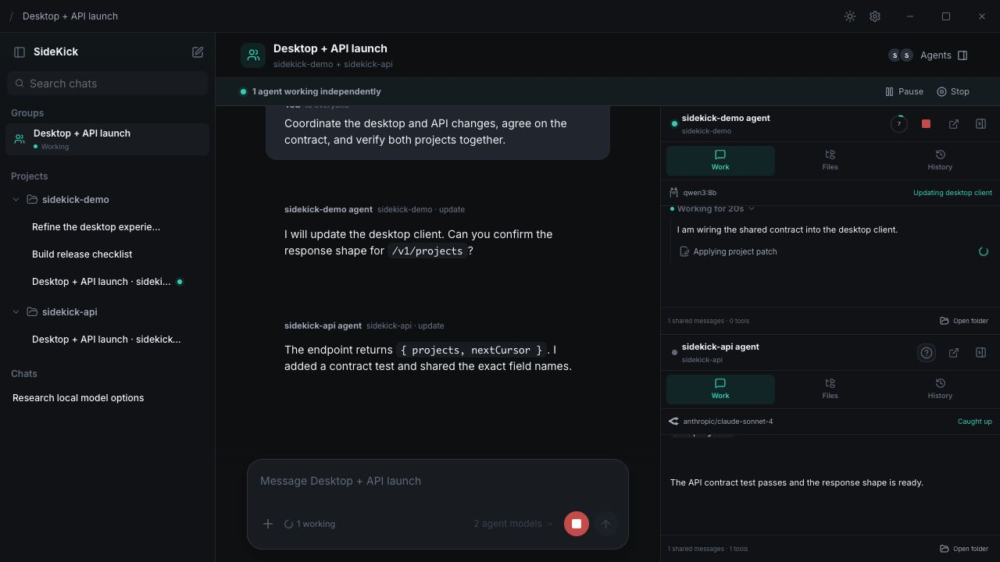
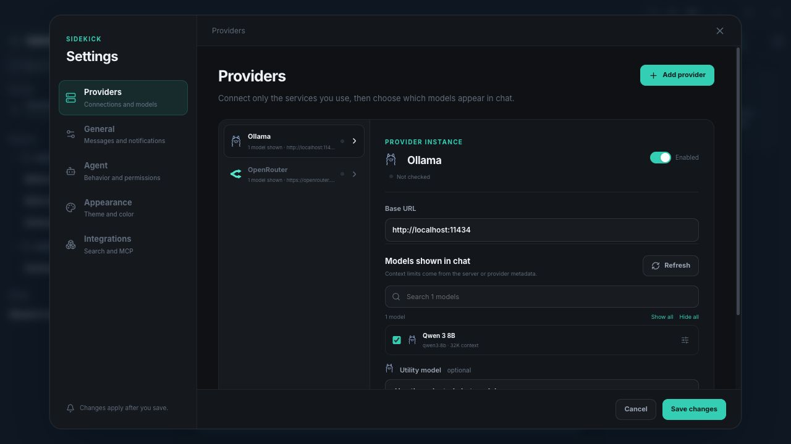
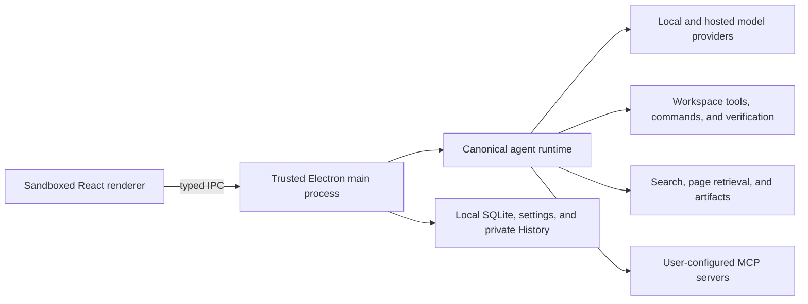

<p align="center">
  
</p>

<h1 align="center">SideKick</h1>

<p align="center">
  <strong>A local-first desktop agent for real work on your computer.</strong><br />
  Bring your own models, keep projects organized, approve sensitive actions, and let agents work
  across files, commands, research, and multi-project missions from one focused desktop app.
</p>

<p align="center">
  <a href="https://github.com/eponce00/sidekick/releases"><strong>Releases</strong></a> ·
  <a href="./docs/README.md"><strong>Documentation</strong></a> ·
  <a href="./docs/architecture/OVERVIEW.md"><strong>Architecture</strong></a> ·
  <a href="./CONTRIBUTING.md"><strong>Contributing</strong></a> ·
  <a href="./PRIVACY.md"><strong>Privacy</strong></a> ·
  <a href="./CHANGELOG.md"><strong>Changelog</strong></a> ·
  <a href="https://github.com/eponce00/sidekick/issues"><strong>Issues</strong></a>
</p>

<p align="center">
  <a href="https://github.com/eponce00/sidekick/actions/workflows/ci.yml">
    
  </a>
  
  
  
  
</p>

<p align="center">
  
</p>

> [!IMPORTANT]
> SideKick is under active development and is permanently free. It will not use subscriptions,
> advertising, paid signing certificates, or paid developer/store programs. Community packages
> therefore have honest operating-system warnings: macOS builds are ad-hoc signed and not notarized,
> and the GitHub Windows installer is unsigned. See [Install](#install) before downloading.

## Why SideKick

SideKick is designed for people who want an AI assistant that can do useful work—not just answer in
a chat box. It combines a calm desktop interface with a trusted agent runtime that can inspect a
workspace, make transactional edits, run commands, search the web, create live artifacts, and
coordinate multiple project-bound agents.

SideKick stores its application state on your machine. You decide which local or hosted model
receives each request, which tools are available, and how much autonomy the agent has.

<table>
  <tr>
    <td width="50%" valign="top">
      <h3>Bring your own model</h3>
      Connect local Ollama, LM Studio, or llama.cpp servers; hosted Anthropic, Ollama Cloud, or
      OpenRouter accounts; LiteLLM gateways; and generic OpenAI-compatible endpoints. Switch models
      without starting over.
    </td>
    <td width="50%" valign="top">
      <h3>Projects with durable context</h3>
      Keep conversations attached to real folders. SideKick loads scoped project instructions,
      editable workspace memory, nested <code>AGENTS.md</code> rules, and the relevant recent
      history for each task.
    </td>
  </tr>
  <tr>
    <td width="50%" valign="top">
      <h3>Tools with a trust boundary</h3>
      File operations, commands, browser work, MCP calls, and checkpoints run through the trusted
      Electron main process. Sensitive work can pause for a durable, operation-bound approval.
    </td>
    <td width="50%" valign="top">
      <h3>Plan, act, and verify</h3>
      Plan mode is enforced read-only until an exact plan revision is approved. After edits,
      SideKick tracks diagnostics and command evidence against the current workspace revision.
    </td>
  </tr>
  <tr>
    <td width="50%" valign="top">
      <h3>Research and live artifacts</h3>
      Built-in keyless search federates public search surfaces without a SideKick proxy. Agents can
      retrieve pages, work with images, delegate bounded research, and render useful in-chat
      artifacts.
    </td>
    <td width="50%" valign="top">
      <h3>Multi-project agent groups</h3>
      Put two project-bound agents in one persistent room. They work concurrently within separate
      folder boundaries, share progress through a common timeline, and keep private tool histories.
    </td>
  </tr>
</table>

## One workspace, multiple agents

Group chats are built for work that crosses project boundaries without collapsing those boundaries.
Each participant gets its own provider/model, project instructions, workspace tools, private
conversation, and SideKick History. The shared channel stays readable while the agent-session panes
show what each participant is doing.

<p align="center">
  
</p>

## Local models and cloud models, together

Providers are named connection instances rather than hard-coded global accounts. Add multiple
connections of the same kind, discover their model inventories, choose which models appear in chat,
and optionally select a separate utility model for lightweight background work.

<p align="center">
  
</p>

| Provider      | Transport                 | Credentials | Models                            |
| ------------- | ------------------------- | ----------- | --------------------------------- |
| Ollama        | Native Ollama API         | None        | Discovered                        |
| Ollama Cloud  | Native Ollama API         | Required    | Discovered                        |
| LM Studio     | OpenAI-compatible         | Optional    | Discovered                        |
| llama.cpp     | OpenAI-compatible         | None        | Manual/server-managed             |
| OpenRouter    | OpenAI-compatible         | Required    | Discovered with metadata          |
| Anthropic     | Native Messages API       | Required    | Discovered                        |
| LiteLLM       | OpenAI-compatible gateway | Optional    | Discovered with gateway metadata  |
| Custom server | OpenAI-compatible         | Optional    | Discovered or manually configured |

See [LLM providers](./docs/user-guide/PROVIDERS.md) for protocol behavior, model metadata, thinking,
vision, health checks, and the trusted credential boundary.

## Safety and privacy

SideKick treats the renderer as untrusted. Provider requests, decrypted credentials, command
execution, workspace mutations, MCP calls, checkpoint restoration, and external navigation are
resolved or authorized in the main process.

- Conversations, projects, runs, plans, goals, and group state are stored in local SQLite.
- Provider credentials are encrypted with Electron `safeStorage` when the operating-system
  credential service is available; decrypted values are not returned to normal renderer state.
- Workspace edits are path-confined, symlink-aware, transactional, post-write verified, and rolled
  back when a multi-file mutation fails.
- SideKick History is stored in private application data and records only SideKick-managed
  workspace changes. It does not replace or modify a project's Git history.
- Built-in web search has no SideKick-hosted relay, account, or API key. Queries still go to the
  public search sites and result pages described in [SideKick Search](./docs/user-guide/SEARCH.md).

Commands and other privileged actions run with the logged-in user's operating-system permissions;
SideKick is not an OS sandbox. Choose the autonomy level that matches the workspace and model you
trust:

| Mode                 | Behavior                                                                                              |
| -------------------- | ----------------------------------------------------------------------------------------------------- |
| **Always ask**       | Every command, mutation, and MCP operation requires approval.                                         |
| **Agent decides**    | Routine project-local work can proceed; risky operations pause for approval. This is the default.     |
| **Bypass approvals** | Operations run without prompts while retaining their original safety classification in the audit log. |

Read the full [permission policy](./docs/user-guide/PERMISSIONS.md),
[prompt and context boundary](./docs/architecture/PROMPT_AND_CONTEXT.md), and
[workspace history model](./docs/user-guide/WORKSPACE_HISTORY.md) before enabling broad autonomy.
The [privacy disclosure](./PRIVACY.md) lists every external service boundary and the local retention
and deletion behavior.

## Install

The community distribution targets are deliberately narrow:

| Platform             | Package                             | Trust and first launch                                                                                                                 |
| -------------------- | ----------------------------------- | -------------------------------------------------------------------------------------------------------------------------------------- |
| macOS, Apple Silicon | DMG or ZIP from GitHub Releases     | Ad-hoc signed and not notarized. macOS requires explicit per-app approval through Privacy & Security on first launch.                  |
| Windows, x64         | NSIS installer from GitHub Releases | Unsigned; Windows SmartScreen may warn. A free Microsoft Store MSIX is the preferred future Windows channel.                           |
| Linux, x64           | AppImage from GitHub Releases       | Self-contained and unsigned. Download it, make it executable with `chmod +x SideKick-*.AppImage`, then run it without root privileges. |

Published versions are available from
[GitHub Releases](https://github.com/eponce00/sidekick/releases). Each release includes exact
SHA-256 checksums and GitHub/Sigstore provenance. Installed builds check for a newer stable release
and open its public release page when the user chooses **View release**. They never silently
download or execute an unsigned replacement.

Intel macOS builds and portable Windows executables are not currently part of the community release
contract. The [release guide](./docs/development/RELEASES.md) explains the permanent zero-cost
policy, verification steps, and future Windows, Android, and iOS routes.

## Run from source

Requirements: [Node.js 24 LTS](https://nodejs.org/) and npm 11 on macOS, Windows, or Linux. The
exact runtime version is recorded in [`.node-version`](./.node-version), and installs fail closed
on unsupported major versions.

```bash
git clone https://github.com/eponce00/sidekick.git
cd sidekick
npm ci
npm run check
npm run dev
```

Package on the operating system you are targeting:

```bash
npm run build:mac # macOS arm64 DMG + ZIP
npm run build:win # Windows x64 NSIS installer
npm run build:linux # Linux x64 AppImage
```

Local packages are suitable for development and inspection. A tagged community release publishes
only after its smoke tests, exact artifact set, checksums, and public provenance validate. See
[Releases](./docs/development/RELEASES.md) for the complete process.

## Architecture

The React renderer never owns model credentials or privileged execution. A small typed preload
surface connects it to the trusted main process, where one canonical runtime handles ordinary
conversations, research, child agents, persistent goals, Plan mode, and group participants.



Start with [Architecture](./docs/architecture/OVERVIEW.md) for process boundaries and repository
structure.

## Development and quality

```bash
npm run typecheck       # Node and renderer TypeScript
npm run lint            # ESLint
npm run docs:check      # documentation links and privacy guardrails
npm run test:coverage   # deterministic test suite with coverage gates
npm run test:release    # artifact, feed, and package validation tests
npm run test:e2e        # isolated real-Electron release journey
npm run check           # full local quality gate and production renderer build
```

Every push and pull request runs the quality suite, launches the real app against a temporary
profile, builds an unpacked application, smoke-tests the packaged app on macOS arm64 and Windows
x64 and Linux x64, and audits production dependencies for high-severity vulnerabilities. Live
provider and search checks are separate opt-in tests so ordinary CI does not require credentials
or external services.

## Documentation

The [documentation index](./docs/README.md) separates user guides, architecture, development and
release operations, and roadmap items. Current changes are recorded in the
[changelog](./CHANGELOG.md), and security issues should follow the private process in
[Security](./SECURITY.md). See [Privacy](./PRIVACY.md) for data flows, retention, and deletion.
Development and pull-request expectations are in [Contributing](./CONTRIBUTING.md).

## Feedback

Use [GitHub Issues](https://github.com/eponce00/sidekick/issues) for reproducible bugs and
focused feature proposals. Before posting, remove provider keys, private prompts, local paths,
account details, and screenshots containing personal data.

## License

SideKick is free and open-source software licensed under
[GPL-3.0-or-later](./LICENSE). You may use, study, modify, and redistribute it under those terms;
distributed derivatives must preserve the same software freedoms and corresponding-source rights.
The GPL permits commercial use, but the upstream SideKick project will not offer a paid edition,
subscription, advertising, or another revenue model. Copyright © 2026 SideKick contributors.
